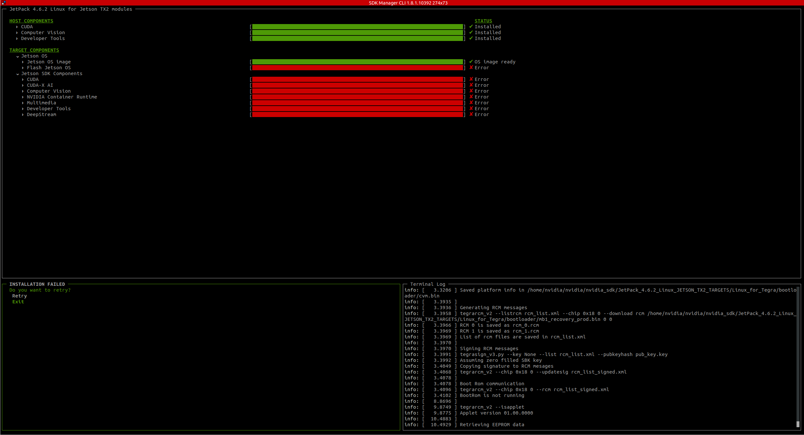

For older Jetson boards (such as TX2) that only supports Jetpack 4.x, normally you will need to have a SDK manager in a native Ubuntu 18.04 system to flash the system. Otherwise, you can try to [use virtual machine (virtualbox) to flash the board](/tech-notes/system/jetson/flash-jetson-with-vm). But it's not guaranteed to work. This is the case for TX2 + Orbitty carrier board I recently tried. One more method is to use the docker image provided by Nvidia. Here are the steps to do it:

## Get Docker Image

* Download the docker image from: https://developer.nvidia.com/nvidia-sdk-manager
* Load and tag the docker image:

```bash
$ docker load -i ./sdkmanager-xxx_docker.tar.gz 
$ docker tag sdkmanager:xxx sdkmanager:latest 
```

* Verify the image can run properly:

```bash
$ docker run -it --rm sdkmanager:latest --ver
```

## Use the SDK Manager in Docker

* Start the docker container with proper resource:

```bash
$ docker run -it --privileged \
	-v /dev/bus/usb:/dev/bus/usb/ \
	-v /dev:/dev \
	-v /media/$USER:/media/nvidia:slave \
	--name JetPack_TX2 --network host sdkmanager:latest \
	--cli install --logintype devzone --product Jetson --version 4.6.2 --targetos Linux --host --target JETSON_TX2_TARGETS --flash all --additionalsdk 'DeepStream 6.0.1'
```

Now you should have a TUI similar to the GUI-version of SDK manager. Choose the right target board and start installing packages and creating the OS image.



You may proceed with the TUI-version of SDK manager and finish the flashing process. If the SDK manager fails to flash, you can manually flash the system with the **"flash.sh"** script located at: ~/nvidia/nvidia_sdk/JetPack_4.6.2_Linux_JETSON_TX2_TARGETS/Linux_for_Tegra:

```bash
# open a new terminal and attach to the running container
$ docker exec -it <container-id> bash
$ cd ~/nvidia/nvidia_sdk/JetPack_4.6.2_Linux_JETSON_TX2_TARGETS/Linux_for_Tegra
$ sudo ./flash.sh jetson-tx2 mmcblk0p1
```

Note: The local user inside the Docker is nvidia with nvidia as the password. The home folder is /home/nvidia.

If you're using a third-party carrier board, you may need to apply the BSP patch before flashing the system:

```bash
$ cd ~/nvidia/nvidia_sdk/JetPack_4.6.2_Linux_JETSON_TX2_TARGETS/Linux_for_Tegra
$ wget https://connecttech.com/ftp/Drivers/CTI-L4T-TX2-32.7.2-V001.tgz
$ tar -xzf CTI-L4T-TX2-32.7.2-V001.tgz
$ cd CTI-L4T & sudo ./install.sh
$ sudo ./cti-flash.sh
```

## Save the Image

You can save the state of the image so that you don't have to repeat the download and build process again next time when you flash the same board:

```bash
$ docker commit <container-id>  sdkmanager:tx2-orbbity
```

Note: it may take a long time to save the commit as the size of the image get much bigger with everything downloaded.

## Reference

* [1] https://docs.nvidia.com/sdk-manager/docker-containers/index.html