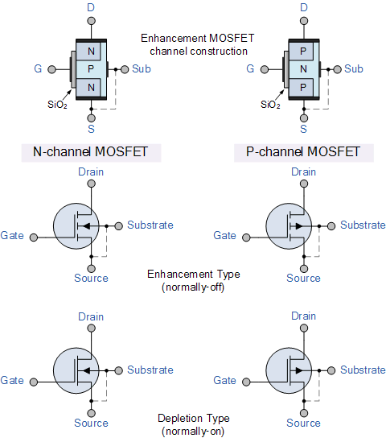
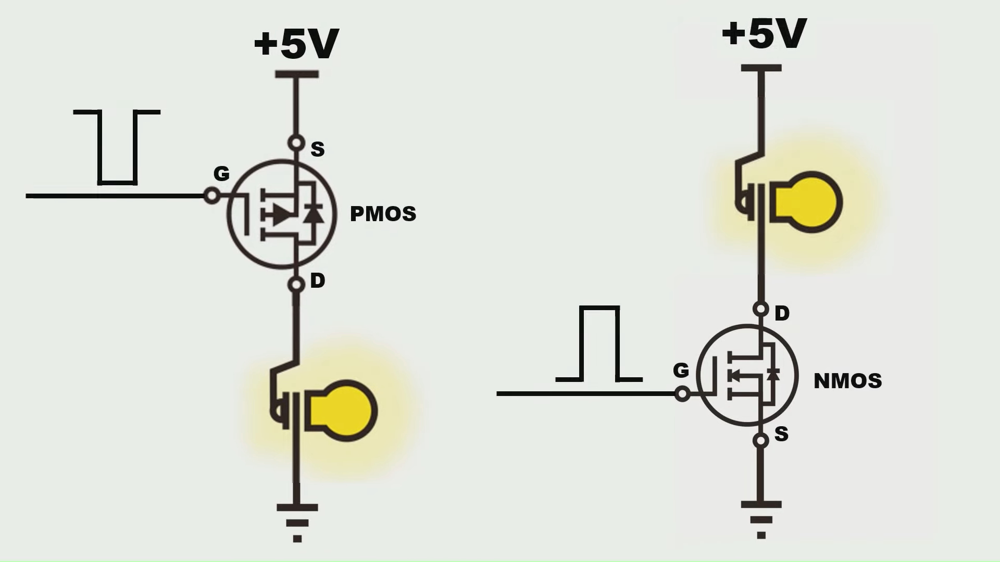

# MOSFET Reference

This note summarizes the key characteristics of MOSFET and some of its typical use cases. Some of the figures and tables are taken from tutorials listed in the `Reference` section.

## MOSFET Types

MOSFET is a type of device where the current flows between its drain and source terminals ($I_D$) can be controlled by the voltage between its gate and source terminals ($V_{GS}$). There are 4 types of MOSFET: N-channel, P-channel of enhanced type or depletion type for each. Their symbols are given below [1]:

Enhanced-type N-channel MOSFET (NMOS) is the most commonly used type. Enhanced-type P-channel MOSFET (PMOS) may also be used in certain cases. Depletion type MOSFETs are rarely used in practice.

MOSFET is often used a switch and it operates between its cut-off region and saturation region. The state of its connectivity between drain and source is given in the following table [1].  

|      MOSFET type       | $V_{GS}$ = +ve | $V_{GS}$ = 0 | $V_{GS}$ = -ve |
| :--------------------: | :------------: | :----------: | :------------: |
| N-Channel  Enhancement |       ON       |     OFF      |      OFF       |
| P-Channel Enhancement  |      OFF       |     OFF      |       ON       |
| N-Channel   Depletion  |       ON       |      ON      |      OFF       |
| P-Channel   Depletion  |      OFF       |      ON      |       ON       |

Use N-channel enhanced type MOSFET as an example, you can consider it as a voltage-controlled resistor. When $V_{GS}$ is smaller than $ve$, the resistence is very large and when it's bigger than $ve$, the resistence becomes very small ($R_{dson}$).

## MOSFET as a Switch

The following are two typical use cases of NMOS and PMOS as a switch. [3]

Because NMOS is turned on when $V_{GS}$ is high, it's normally placed at the lower side connecting to the ground so that it doesn't require a very high voltage to turn on. For similar reasons, PMOS is usually placed at the top side conntecting to the power positive so that it's easy to turn it on by pulling the voltage at gate low.

Another difference to note is that the current flows from source to drain in PMOS, which is opposite from the current in NMOS.

## Practical Design

## Reference

* [1] https://www.electronics-tutorials.ws/transistor/tran_6.html
* [2] https://www.electronics-tutorials.ws/transistor/tran_7.html
* [3] https://www.youtube.com/watch?v=Uk1CPNROjNk