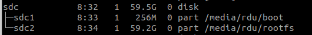

# Cross-compile with Chroot and Docker

Natively compiling a medium to large project could take a long time on Raspberry Pi. In this case, setting up cross-compiling on your host computer and do the hard work on a more powerful desktop CPU could significantly reduce the build time.

## Install Tools

First install the following dependencies in order to run binaries built for arm platforms on an x86_64 computer:

```bash
$ sudo apt install qemu qemu-user-static binfmt-support
```

You can read more about how this works in [3] and even more details from the QEMU project website. Briefly, the setup works as follows

```
arm applications
        |
        v
QEMU arm emulator 
        |
        v
 host OS (x86_64) 
        |
        v
host hardware (x86_64) 
```

## Setup chroot with SD Card

With the above tools, you can now mount the file system on your Raspberry Pi SD card to your host computer and chroot into it. 

Note here it's assumed the SD card has been setup correctly beforehand. You can flash the Raspberry Pi OS as usual to the SD card and make sure you run the initial setup on the Pi board to expand the file system to the whole SD card. Then you can remove the SD card and connect it to to your computer (with a SD to USB adapter). You need to identify the sd card drive name appeared in your computer

```bash
$ lsblk
```

Here I have a SD card with the official Raspberry Pi OS installed, and it appeared as "/dev/sdc"



There is a script from Github that you can use to easily setup the chroot ["chroot-to-pi.sh"](https://gist.github.com/htruong/7df502fb60268eeee5bca21ef3e436eb):

```bash
$ sudo ./chroot-to-pi.sh /dev/sdc
```

I copy the content of the script here just to show what has been done by the script: it first mounts the partitions on the SD card to the host system at /mnt/raspbian and then chroot to this folder. Finally it will do the cleanup work for you after you finish the work in the chroot environment.

```bash
mkdir -p /mnt/raspbian

# mount partition
mount -o rw ${1}2  /mnt/raspbian
mount -o rw ${1}1 /mnt/raspbian/boot

# mount binds
mount --bind /dev /mnt/raspbian/dev/
mount --bind /sys /mnt/raspbian/sys/
mount --bind /proc /mnt/raspbian/proc/
mount --bind /dev/pts /mnt/raspbian/dev/pts

# ld.so.preload fix
sed -i 's/^/#CHROOT /g' /mnt/raspbian/etc/ld.so.preload

# copy qemu binary
cp /usr/bin/qemu-arm-static /mnt/raspbian/usr/bin/

echo "You will be transferred to the bash shell now."
echo "Issue 'exit' when you are done."
echo "Issue 'su pi' if you need to work as the user pi."

# chroot to raspbian
chroot /mnt/raspbian /bin/bash

# ----------------------------
# Clean up
# revert ld.so.preload fix
sed -i 's/^#CHROOT //g' /mnt/raspbian/etc/ld.so.preload

# unmount everything
umount /mnt/raspbian/{dev/pts,dev,sys,proc,boot,}
```

## Build/Run Docker Image for Arm Platform on x86 Computer

Install the docker engine by following instructions [here](https://docs.docker.com/engine/install/ubuntu/).

You can check the architecture of your system using uname command. 

```bash
uname -m
```
On you host computer, you should get a string "x86_64". But if you try to run a docker image built for arm platform, you will get execution errors. 

To make this work, you need to run the following docker image, in addition to installing the above tools:

```bash
sudo docker run --rm --privileged multiarch/qemu-user-static --reset -p yes
```

You can get more details about "qemu-user-static" from its Github page [here](https://github.com/multiarch/qemu-user-static). Now you should be able to build or run docker image for Arm platforms. Note you will need to find a proper base image, e.g. nvcr.io/nvidia/l4t-base:r32.6.1 for a Nvidia Jetson board. Refer to [3] for a more detailed example. 

## Reference

* [1] https://www.j1nx.nl/diy/crosscompiling-software-for-raspbian-in-a-chroot-environment/
* [2] https://gist.github.com/htruong/7df502fb60268eeee5bca21ef3e436eb
* [3] https://www.stereolabs.com/docs/docker/building-arm-container-on-x86/
* [4] https://github.com/multiarch/qemu-user-static
