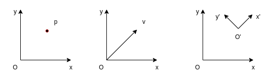
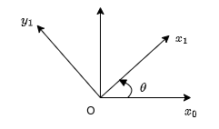

# Rigid-body Motion

## Rigid-body Motion Representation

Notes in this section are mainly based on reference [1] and follow the same notations.

!!! note "Notations"

    A superscript is used to denote the reference frame, for example

    * The position of point 0 with respect to **b** frame: $p^b_0$
    * The orientation of the body frame **b** with respect to the world frame **w**: $R^w_b$

### Rigid Motion

"A rigid motion is an ordered pair $(d, R)$ where $d \in \mathcal{R}^3$ and $R \in \mathcal{SO}(3)$. The group of all rigid motions is known as the **Special Euclidean Group** and is denoted by $\mathcal{SE}(3)$." [1]  
  
\[
\mathcal{SE}(3) = \mathcal{R}(3) \times \mathcal{SO}(3)
\]

The $d$ part corresponds to a translation and the $R$ part corresponds to a rotation.

### Position Representation

A position vector can be represented with a column vector. A point in space can be represented with different coordinates when the representations are with respect to different reference frames. For example, a point on a 2D plane can be represented as

\[
p^0 = 
\begin{bmatrix}
1  \\
1 
\end{bmatrix}, \;\;\;
p^1 = 
\begin{bmatrix}
\sqrt{2}  \\
0 
\end{bmatrix}
\]

where reference frame 1 is rotated counter-clockwise by $45^{\circ}$ with respect to reference frame 0.

Note that a column vector on the other hand may be the representation of different objects, not limited to a point:

1. The position of a point
2. The coordinates of a free vector, representing a translation
3. The position of one coordinate system with respect to another



### Rotation Representation

#### Rotation Matrix

A rotation is most commonly represented with a rotation matrix $R \in \mathcal{SO}(n)$, where $\mathcal{SO}(n)$ denotes the **Special Orthogonal group** of order n. 

The properties of a rotation matrix $R$:

* $R \in \mathcal{SO}(n)$
* $R^{-1} \in \mathcal{SO}(n)$
* $ R^{-1} = R^T$
* The columns (and therefore the rows) of $R$ are mutually orthogonal
* Each column (and therefore each row) of $R$ is a unit vector
* $\det{R} = 1$

The rotation matrix on a 2D plane is given as 

\[
R^0_1 = 
\begin{bmatrix}
\cos\theta & -\sin\theta \\
\sin\theta & \cos\theta
\end{bmatrix}, \;\;\;
R^1_0 = 
\begin{bmatrix}
\cos\theta & \sin\theta \\
-\sin\theta & \cos\theta
\end{bmatrix}
\]



Thus for a point $p^{0} = \begin{bmatrix} 1 \\ 1\end{bmatrix}$ in reference frame 0, it can be represented with respect to reference frame 1

\[
p^{1} = R^1_0p^0 
= \begin{bmatrix}
\cos\theta & \sin\theta \\
-\sin\theta & \cos\theta
\end{bmatrix}
\begin{bmatrix} 1 \\ 1\end{bmatrix} 
= \begin{bmatrix} \cos\theta + \sin\theta \\ -sin\theta+\cos\theta\end{bmatrix}
\]

In the case that $\theta=\pi/4$, we get $p^1=\begin{bmatrix} \sqrt{2} \\ 0\end{bmatrix}$, which is the same with the example given above.

A rotation matrix can also be interpreted in multiple ways [1]:

1. A coordinate transformation relating the coordinates of a point $p$ in two different frames
2. The orientation of a transformed coordinate frame with respect to a fixed coordinate frame
3. An operator taking a vector and rotating it to a new vector in the same coordinate system

Note that applying a translation to a free vector won't change the vector (direction and magnitude), but applying a rotation may change the vector to be a new one. 

#### Euler Angles

A rotation matrix can be specified by the composition of 3 consecutive rotations. Each of the rotation is represented by an angle ($\psi/\theta/\phi$) around a specified main axis ($x/y/z$). There are many different combinations of Euler angles. For example, an ZYZ-Euler angle is given by $R_j{ZYZ} = R_{z,\phi}R_{y,\theta}R_{z,\psi}$.

#### Roll, Pitch, Yaw Angles

Roll, pitch, yaw angles can be seen as a special case of Euler angles. In robotics, the body coordinate frame fixed to the robot is usually defined as z-axis pointing up, x-axis pointing front and y-axis point left. In such a case, yaw angle cooresponds to the rotation around z-axis, pitch angle  cooresponds to the rotation around y-axis and roll angle  cooresponds to the rotation around x-axis. Note that different conventions do exist for defining the body reference frame and naming roll, pitch and yaw angles (e.g. in aerospace engineering literature).

#### Axis/Angle

Axis/angle representation used the rotation angle around an arbitrary axis to represent a rotation and is often used to create other types of representations.

#### Quaternion

Quaternion representation is widely used for computation of 3D rotations. It is given in the form 

\[
    \vec{q} = w + x\vec{i} + y\vec{j} + z\vec{k}, \textnormal{or}\;\; \vec{q} = (w,x,y,z) = (w, \vec{v})
\]

The basis $\vec{i},\vec{j},\vec{k}$ follow the following rules:

\[
\begin{align*}
ij &= -ji = k \\
jk &= -kj = i \\
ki &= -ik = j \\
i^2 = j^2 &= k^2 = ijk = -1
\end{align*}
\]

Generally the quaternions we use to describe orientations are unit quaternions, i.e. $\| q \| = \sqrt{w^2 + x^2 + y^2 + z^2} = 1$. A non-unit quaternion can be normalized by 

\[
    \hat{q} = \frac{q}{\| q \|}
\]

Note that "matrices represent linear transforms; quaternions represent a special case of linear transform: rotations in 3 dimensions"[4]. 

In addition to the quaternion itself, we have:

* Quaternion Conjugate: $q^{*} = (w, -\vec{v})$
* Quaternion Inverse: $q^{-1} = \frac{q^{*}}{{\| q \|}^2}$, for unit quaternion, we have $q^{*} = q^{-1}$

The following operations are frequently used:

* A point or vector $\vec{v}$ can be rotated by a quaternion $q$ by operation

\[
\vec{v}^{\prime} = q\vec{v}q^{-1}
\]

* An orientation $O$ can be rotated by a quaterion $q$ by operation

\[
O^{\prime} = qO
\]

* Multiple rotations can be composed by multiply the quatenion from the left (pre-multiply), for example, $O^\prime$ is the orientation as if $q_1$ were applied to $O$, then $q_2$, then $q_3$

\[
O^{\prime} = q_3q_2q_1O
\]

Quaternions can be used to do the calculation efficiently but are not so intuitive to understand. Reference [3] and [5] are highly recommended if more details are required. 

### Composition of Rotations

A summary of the rule of composition of rotational transformations can be found in [1]:

Given a fixed frame $o_0x_0y_0z_0$, a current frame $o_1x_1y_1z_1$, together with rotation matrix $R^0_1$ relating them, 

* if a third frame $o_2x_2y_2z_2$ is obtained by a rotation $R$ performed relative to the **current frame** then post-multiply $R^0_1$ by $R=R^1_2$ to obtain 

\[R^0_2 = R^0_1R^1_2\]

* if the second rotation is to be performed relative to the **fixed frame**, then pre-multiply $R^0_1$ by $R$ to obtain

\[R^0_2 = RR^0_1\]

The first case of composition is more commonly seen and it's also more intuitive to understand.

!!! Tip "The multiple meanings of a vector and matrix"

    The multiple meanings a vector or a matrix can easily cause confusions when handling rigid-body motions. Interpretation 3 of a vector and interpretation 2 of a matrix listed above are often used when you're considering the relationship between two cooredinate frames in order to set up new frames. Interpretation 2 of a vector and interpretation 3 of a matrix are often used when you're handling the calculation of transformations in order to transform a pose from one coordinate frame to another.

### Homogeneous Transformation

A homogeneous transformation matrix combines translation and rotation into one matrix and could be used to simplify the calculation of transformations.

\[
H = \begin{bmatrix}
R & d \\
0 & 1
\end{bmatrix}; \;\;\; 
R \in \mathcal{SO}(3), d \in \mathcal{R}^3
\]

Using the factor that $R$ is orthogonal, we can get the inverse transformation as

\[
H^{-1} = \begin{bmatrix}
R^T & -R^Td \\
0 & 1
\end{bmatrix}
\]

In order to apply a homogeneous transformation, a column vector must be augmented

\[
P^0 = \begin{bmatrix}
p^0 \\
1
\end{bmatrix},
P^1 = \begin{bmatrix}
p^1 \\
1
\end{bmatrix}
\]

Then we have the equivalent calculation with 

\[p^0 = R^0_1p^1 + d^0_1\]

in the matrix form

\[
P^0 = H^0_1P^1
\]

#### Composition rule for homogeneous transformations

Given a homogeneous transformation $H^0_1$ relating two frames [1]:

* if a second rigid motion, represented by $H \in \mathcal{SE}(3)$ is performed to the **current frame**, then 
  
\[
H^0_2 = H^0_1H^1_2
\]

* if the second rigid motion is performed relative to the fixed frame, then 

\[
H^0_2 = HH^0_1   
\]

## Rigid-body Motion Calculation with Eigen

More relevant details can be found from Eigen offical documentation page [6][7][8] and this tutorial [9]. Here I only keep the most frequently used use cases. Source code in this section can be found on this [GitHub repo](https://github.com/rxdu/eigen_sample).

The type "Vector3f" is a column vector in Eigen, thus it can be used directly to represent a position. Eigen also provides data types to present a rotation matrix, axis-angle and quaternion.

### Pose Representation with Eigen

Examples for the pose (position and orientation) representation with Eigen:

```cpp
Eigen::Vector2d p2d(1.0, 2.0);
std::cout << "A point in 2d: \n" << p2d << std::endl;

Eigen::Vector3d p3d(1.0, 2.0, 3.0);
std::cout << "A point in 3d: \n" << p3d << std::endl;

Eigen::Matrix3d R;
R << 0, -1, 0, 1, 0, 0, 0, 0, 1;
std::cout << "A rotation matrix: \n" << R << std::endl;

Eigen::Quaterniond q_from_R(R);
std::cout << "A quaternion from rotation matrix: \n" << q_from_R.coeffs() << std::endl;

Eigen::Quaterniond q_unit = Eigen::Quaterniond::Identity();
std::cout << "A unit quaternion: \n" << q_unit.coeffs() << std::endl;

Eigen::Quaterniond q(2, 0, 1, -3);
std::cout << "A non-normalized quaternion: \n" << q.coeffs() << std::endl;

q.normalize();
std::cout << "A normalized quaternion: \n" << q.w() << std::endl << q.vec() << std::endl;

Eigen::Matrix3d R_from_q = q.toRotationMatrix();
std::cout << "A rotation matrix from quaternion: \n" << R_from_q << std::endl;

Eigen::Matrix3f R_from_angleaxis;
R_from_angleaxis = Eigen::AngleAxisf(0.25 * M_PI, Eigen::Vector3f::UnitX())
    * Eigen::AngleAxisf(0.5 * M_PI, Eigen::Vector3f::UnitY())
    * Eigen::AngleAxisf(0.33 * M_PI, Eigen::Vector3f::UnitZ());
std::cout << "A rotation matrix from angle-axis: \n" << R_from_angleaxis << std::endl;

Eigen::Quaternionf q_from_angleaxis(Eigen::AngleAxisf(0.33 * M_PI, Eigen::Vector3f::UnitZ()));
std::cout << "A quaternion from angle-axis: \n" << q_from_angleaxis.coeffs() << std::endl;
```

### Transformation with Eigen


## Reference

* [1] Spong, M.W. and Hutchinson, S. and Vidyasagar, M. (2005). Robot Modeling and Control. Wiley.
* [2] Lynch, K. M., & Park, F. C. (2017). Modern Robotics: Mechanics, Planning, and Control. Cambridge Univeristy Press.
* [3] https://eater.net/quaternions
* [4] https://www.anyleaf.org/blog/quaternions:-a-practical-guide
* [5] https://www.3dgep.com/understanding-quaternions/
* [6] https://eigen.tuxfamily.org/dox/group__QuickRefPage.html
* [7] https://eigen.tuxfamily.org/dox/group__TutorialGeometry.html
* [8] https://eigen.tuxfamily.org/dox/group__TutorialMatrixClass.html
* [9] https://www.cc.gatech.edu/classes/AY2015/cs4496_spring/Eigen.html