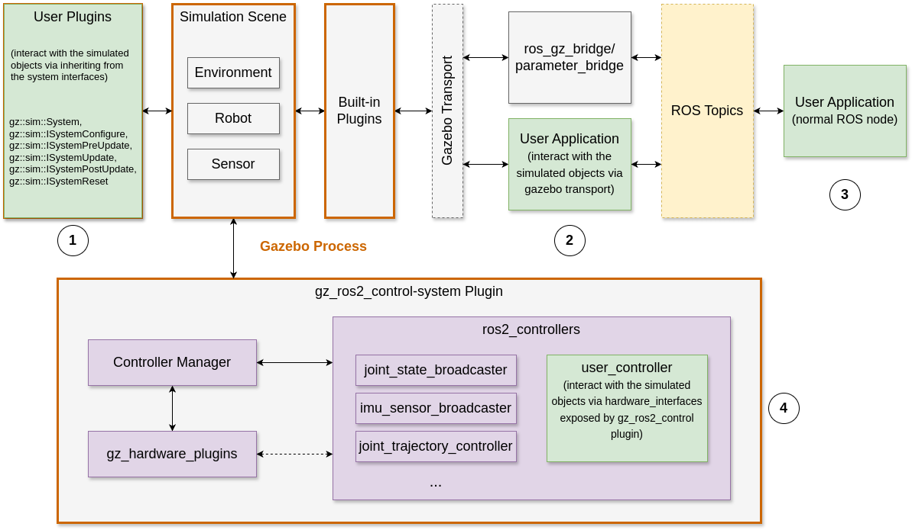

# Gazebo Simulator

!!! info 

    This note was written with the assistance of ChatGPT.

Gazebo can be used as a standalone robot simulator. But in practice, it's mostly used together with ROS. The setup described in this note is mainly in the ROS context.

* **Gazebo**: Ignition Gazebo (Fortress or later)
* **ROS**: Humble or later

## Robot Kinematics

Robot kinematics is handled with TF in ROS. During the real robot and simulation setup, the following ROS nodes may be used and often get confused:

* `robot_state_publisher`: subscribes to joint_states and uses the robot’s URDF to compute and publish the TF transforms of each link in the robot.
* `joint_state_publisher`: publishes the values of each joint (positions, optionally velocities/efforts) on the `joint_states` topic.
* `joint_state_broadcaster`: publishes the values of joint position, velocity, and/or effort on the `joint_states` topic

Differences between `joint_state_publisher` and `joint_state_broadcaster`:

* The `joint_state_broadcaster` is used in a ros2_control-based setup:
    - Real joint states come from your hardware drivers (or simulation).
    - Those are read by the ros2_control infrastructure.
    - The joint_state_broadcaster publishes them on /joint_states.
* The `joint_state_publisher` node (and its GUI version `joint_state_publisher_gui`) is generally used for simpler, static, or manually-driven demos rather than for reading real hardware data. It doesn't have the knowledge of the real or simulated robot and it just publishes the specified or default values from the configuration file or ROS parameters.

Relationship between `robot_state_publisher` and `joint_state_publisher`/`joint_state_broadcaster`:


* Both `joint_state_publisher` and `joint_state_broadcaster` can publish to the /joint_states topic but they have different use cases:
    * The `joint_state_publisher` reads the `robot_description` parameter from the parameter server or configuration file, finds all of the non-fixed joints and publishes a JointState message with all those joints defined. It's often used during the development of the robot model (i.e. writing the urdf/xacro).
    * The `joint_state_broadcaster` works as part of the ros2_control framework and publish to the /joint_states topic with information acquired from the real robot or the simulator.
    * In general, you don't need both in one setup. `joint_state_broadcaster` can dynamically update and publish joint states, while `joint_state_publisher` mainly publishes configurable but mostly static joint states. 
* If no one is publishing joint states, the `robot_state_publisher` can’t do much as its TF frames will be at default or uninitialized states.

## Robot Model

Gazebo uses `SDF` to describe the robot and the simulation environment. In the ROS ecosystem, `URDF` and `xacro` are more commonly used to describe the robot links and joints.

* [SDF Specifications](http://sdformat.org/spec)
* [URDF Specifications](https://wiki.ros.org/urdf/XML)
* [xacro Specifications](https://wiki.ros.org/xacro)

xacro provides features such as macro/property/expression/condition to make it easier to write shorter and more readable description of the robot. A xacro XML file can be easily converted to a URDF XML file without loosing information. Tags supported by xacro/URDF is more or less a subset of thoese in SDF. SDF also allows you to specify properties of the environment, physics, scene etc. You can also convert a URDF file to SDF file.

```bash
# xacro to urdf
$ xacro robot.xacro > robot.xacro.urdf 

# urdf to sdf
$ ign sdf -p ./robot.xacro.urdf  > robot.urdf.sdf
```

Some general guidelines for choosing the most suitable format:

* If your development is mainly around Gazebo, SDF may be the best choice since you can easily configure both the robot and simulation setup.
* If your simulation setup is tightly coupled with ROS, for example, when you use ros2_control framework, xacro is the preferred choice, as it's well supported both by Gazebo and ROS. Gazebo support [spawning a robot defined by URDF into an environment defined by SDF](https://gazebosim.org/docs/fortress/spawn_urdf/).

## Gazebo Interface

Gazebo contains a set of components that handles robot/environment model management and dynamic simulation with a physics engine. It's built with a plugin system, which integrates all the components into a complete system that can be easily extended. The architecture diagram can be found in the [official documentation](https://gazebosim.org/docs/latest/architecture/).

There are multiple ways you can interact with simulation entities (e.g. robot, sensors).



As shown in the above diagram, green blocks 1-4 represent user code that may interact with the simulated environment. 

* Block 1 is a Gazebo plugin completely implemented by the user, in which you can define what you want to do before/during/after each simulation update.
* Block 4 is a plugin provided by the ros2_control project. You configure the joints and supported sensors in the URDF and  the plugin will create a controller manager that connects the controllers to the hardware interfaces. You can use both the controllers implemented in ros2_controllers or implement your own controller.
* Block 2 adds a layer of separation by utilizing the Gazebo transport. Unlike the plugin method in which the plugins run in the same process with the Gazebo simulator, user code runs in a separate process and communicates with the simulator via the Gazebo transport. You can check the topics using `ign topic list` or `gz topic list`.
* Block 3 is a normal ROS node and it can only communicate with the simulator if the Gazebo transport topics are translated to ROS topics using ros_gz_bridge or a user-implemented node. 

In general, you should consider the best interfacing method based on your use cases:

* If you're following the ros2_control workflow to implement a controller for your robot, method 4 might be most suitable.
* If you want to implement a custom sensor/device, method 1 is straightforward.
* If you just try to add a built-in sensor (such as Lidar/Camera) provided by Gazebo, you may simply configure the sensor in the URDF and use the ros_gz_bridge to expose the sensor data to the ROS network.
* If you want something less coupled with Gazebo, method 2 and/or 3 can be considered.

You may find the following GitHub repositories useful when developing applications that interface with the Gazebo simulator:

* [https://github.com/gazebosim/gz-sim](https://github.com/gazebosim/gz-sim)
* [https://github.com/gazebosim/ros_gz](https://github.com/gazebosim/ros_gz)
* [https://github.com/ros-controls/gz_ros2_control](https://github.com/ros-controls/gz_ros2_control)
* [https://github.com/ros-controls/ros2_controllers](https://github.com/ros-controls/ros2_controllers)

A project template for creating Gazebo plugins can be found in the repository with [documentation](https://gazebosim.org/docs/harmonic/ros_gz_project_template_guide/): 

* [https://github.com/gazebosim/ros_gz_project_template](https://github.com/gazebosim/ros_gz_project_template)

## Reference

* https://gazebosim.org/docs/fortress/ros2_interop/