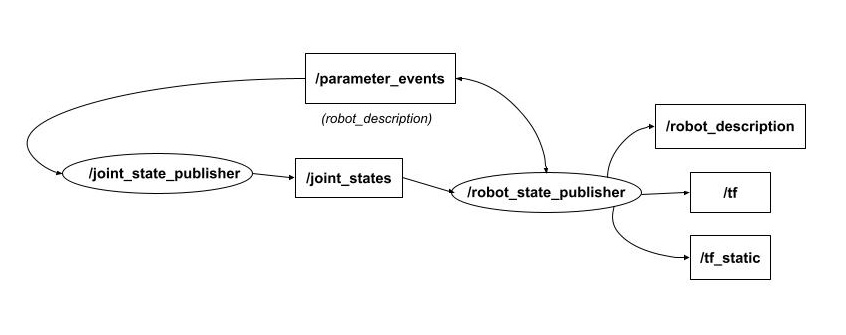

# Gazebo Simulator

Gazebo can be used as a standalone robot simulator. But in practice, it's mostly used together with ROS. The setup described in this note is mainly in the ROS context.

* Gazebo: newer Ignition Gazebo
* ROS: Humble or later

## Robot Kinematics

## Reference:

* https://gazebosim.org/docs/fortress/ros2_interop/