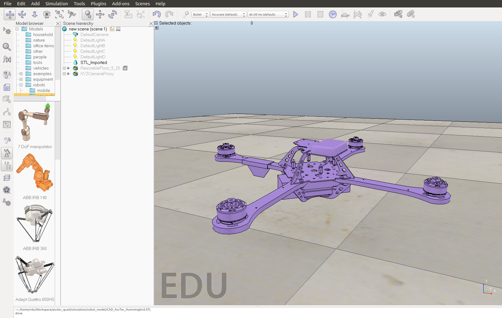
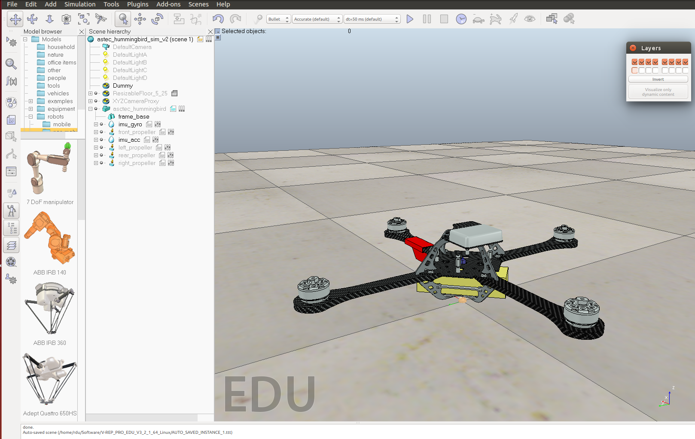
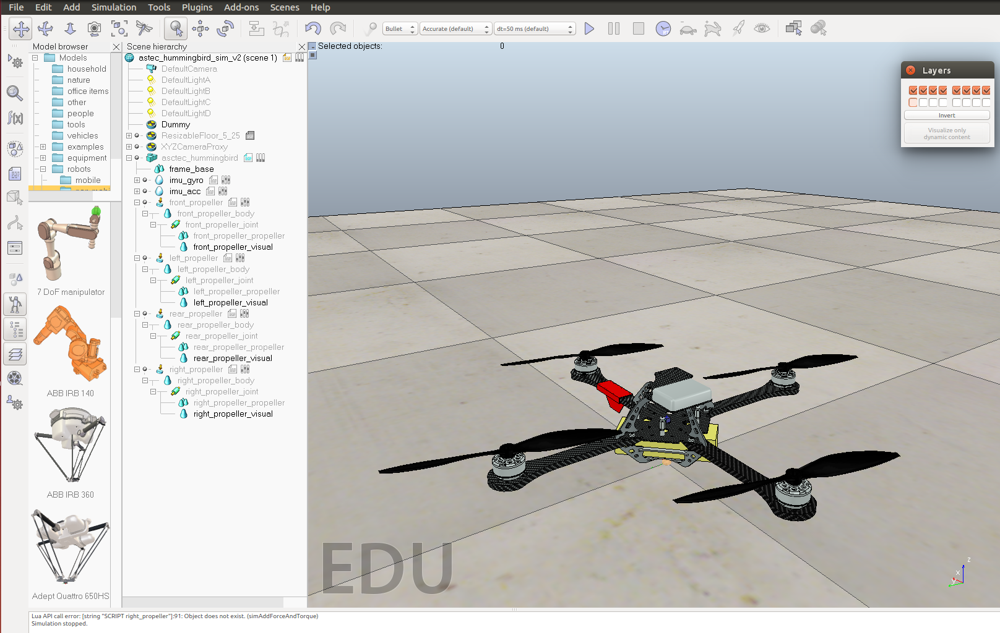

# CoppeliaSim (V-REP) Simulator

## Robot Simulation in V-REP

V-REP (virtual robot experimentation platform) is a dual-licensed software. It provides free educational license for the pro-edu version and source code with GNU GPL license. Compared to Gazebo, V-REP is self-contained (meaning less dependencies), cross-platform (linux/windows/mac) and feature rich (more robots/sensors usable out-of-box). Moreover it's more user-friendly and requires less time to set up your customized robot.

Before starting working with V-REP, I would suggest you to "play with" it for a while. Try out different mobile/non-mobile robots and explore what's available from the "Model Browser". Watch this [video](https://www.youtube.com/watch?v=xI-ZEewIzzI). But at this point don't try to grasp every detail yet. Just get yourself familiar with the UI and learn how to change the position/orientation of the robot/component inside the simulation scene.

### Key components of a simulation in V-REP

There are mainly two parts that you need to take care of for setting up a simulator of your robot. The first part is about the robot. What you need to prepare include the dynamic model (not the mathematic one, but a simplified geometrical model for the physics engine) and the robot mechanical model (a more detailed one compared to the dynamic model for visualization). If you want your robot look better in the simulator, you may also want to prepare texture files, extra 3D components (for example better-looking wheels for your mobile robot).

The second part is the simulated environment. In V-REP, a simulated environment is called a scene. A scene may include robots, sensors and other elements like furniture, office items. Each one of them is called an object. V-REP makes heavy use of Lua scripts. Almost all objects in the simulation scene are attached with one or more scripts, which are coordinated by the main script which is attached to the scene. The main script controls the "actuation"-"sensing"-"display" process of each object in a simulation step repeatedly to get the simulation running. It also invokes the physics engine to advance in time. Refer to this [article](http://www.coppeliarobotics.com/helpFiles/en/mainScript.htm) for more details. As mentioned before, each object is attached with a script. V-REP supports two types of scripts: threaded and non-threaded. In most cases a non-threaded script is used and this type of scripts follows the "actuation"-"sensing"-"display" steps, controlled by the main script. If you want to have more control in addition to the these controlled steps and do something in parallel with the main simulation process, you can do that in a threaded script. Read this [article](http://www.coppeliarobotics.com/helpFiles/en/childScripts.htm) about child scripts.

After getting these two ready, the next thing you need to figure out is how to interface with the simulation scene, such as acquiring sensor data and sending motor commands. Once your robot is simulated in a scene and you can also talk with your robot, you can play with it for whatever purposes, like implementing your dynamic control algothrim or testing the mapping and localization function of your robot, just like you do with your real robot.

At this point, you should have got a rough idea about how V-REP works. For most of the components provided by V-REP, if they don't behave as you desire it to be. Probably you will just need to tweak the attached script. For example, if you want to change the behavior of the propeller module, you just need to open the script, locate to the actuation part and adjust the force/torque formula it use.

### Create a robot model

If your robot is very simple (say it only consists of a few primitive shapes - cube, cylinder, sphere ...), you can start creating your robot right in V-REP. And you can use these shapes for both visualization and dynamics simulation. But if your robot is more complicated, you might want to import your mechanical models (.stl/.obj/.dxf files) to V-REP. In this case, the visualization part should be straightforward since your simulated robot is created from the design file of the real robot. However for the physics engine, these (usually non-convex) shapes can be computational in-efficient and potentially unstable. So it's preferred that you can create a simplified geometrical model for the dynamics calculation. Refer to this [article](http://www.coppeliarobotics.com/helpFiles/en/designingDynamicSimulations.htm) for more details.

In V-REP, you can use put visualization models and dynamics models in different layers so that you can just inspect the part that you're interested in. In V-REP, you need to decide two properties for all parts of your robot: static/non-static, respondable/non-respondable. The basic idea is that non-static (dynamic) parts are considered in the calculation of the physics engine and respondable parts are considered in the collision checking, sensor detection etc. The article " Designing dynamic simulations" describes this in details. In general, you should set your dynamic models to be non-static and respondable, while for the more detailed visualization models they should be static and non-respondable. In addition, you should also set parameters such as mass/inertia properly to the dynamics models. This may require you to know the mathematic model of your robot.

### Set up a simulation scene

Once your robot is set up, you can now add more sensors to it. And according to your application, you can even set up different environments such as an office room or a dessert area. Again you may need to tweak the script of the object you add to the scene to make it behave like what you want.

### Connect V-REP with your application

Now you've got a robot simulated and running in V-REP. What's next? You probably want to read sensor data from the simulated robot and do control over it. That's the main point you want to set up a simulator for it.

V-REP provides a few methods to do so. Basically there are two types of interfacing methods: internal communication and inter-process communication. Refer to this \* [tutorial](http://www.coppeliarobotics.com/helpFiles/en/externalControllerTutorial.htm) to know more about the advantages and disadvantages of each method. If you want to use similar code to control both the simulated robot and the real robot, the remote API may be the best one to use. The work flow is that you first start a server when you start the simulation, then call the remote API functions in your normal control code to read sensor data and send motor commands. Your code acts as a client respect to the server. Watch this nice [video](https://www.youtube.com/watch?v=SQont-mTnfM) for an example and read this [article](http://www.coppeliarobotics.com/helpFiles/en/remoteApiModusOperandi.htm) to know more about the remote API. At this point, you should be able to have a much better understanding of these articles: [article1](http://www.coppeliarobotics.com/helpFiles/en/meansOfCommunication.htm), [article2](http://www.coppeliarobotics.com/helpFiles/en/writingCode.htm).

Another point that's worthy of mentioning is that there are different ways of communication between sensors and actuators as discussed in "Means of communication in and around V-REP". The regular API provides support for all of them, but it's not the case for the remote API. If a sensor is using tube to publish its data and you want to get the data via the remote API. One easy solution is that you can just modify the script of that sensor and use signals to send out data, which is a way that both regular API and remote API support.

**Reference**

- [Youtube Video - Line-Following Robot V-Rep Tutorial](https://www.youtube.com/watch?v=xI-ZEewIzzI)
- [V-REP Doc - The main script](http://www.coppeliarobotics.com/helpFiles/en/mainScript.htm)
- [V-REP Doc - Child scripts](http://www.coppeliarobotics.com/helpFiles/en/childScripts.htm)
- [V-REP Doc - Designing dynamic simulations](http://www.coppeliarobotics.com/helpFiles/en/designingDynamicSimulations.htm)
- [V-REP Tutorial - Importing and preparing rigid bodies tutorial](http://www.coppeliarobotics.com/helpFiles/en/rigidBodyTutorial.htm)
- [V-REP Tutorial - External controller](http://www.coppeliarobotics.com/helpFiles/en/externalControllerTutorial.htm)
- [Youtube Video - Connect V-REP and Python through Remote API](https://www.youtube.com/watch?v=SQont-mTnfM)
- [V-REP Doc - Remote API modus operandi](http://www.coppeliarobotics.com/helpFiles/en/remoteApiModusOperandi.htm)
- [V-REP Doc - Means of communication in and around V-REP](http://www.coppeliarobotics.com/helpFiles/en/meansOfCommunication.htm)
- [V-REP Doc - Writing code in and around V-REP](http://www.coppeliarobotics.com/helpFiles/en/writingCode.htm)

## Case Study: Create a Quadrotor Simulation in V-REP

In this case study, you will see how to create the simulation of the AscTec Hummingbird Quadrotor.

Components for the simulation:

- Quadrotor main frame
- 4 propellers
- IMU sensor(gyro + accelerometer)

It's highly recommended to read this [official tutorial](http://www.coppeliarobotics.com/helpFiles/en/rigidBodyTutorial.htm) and follow the steps by yourself before you start creating a simulation of your own robot. This case study assumes you've already read the contents of this tutorial and the previous sections of this wiki. The goal is only to show you the work flow of using V-REP with a more specific example, thus a lot of operation details are omitted. If you get any problems in the process, **always remember** to check the [official documentation](http://www.coppeliarobotics.com/helpFiles/index.html) and the [official forum](http://www.forum.coppeliarobotics.com/index.php). In most cases you should be able to find the answer. It's also very common that you check the implementation of a existing robot model to get an idea of how to implement a specific feature on your own robot. The example robot models and scenes provided by V-REP are very good resources for you to learn V-REP. In addition, you can try to post your question on the forum. According to my experience, they respond to questions very fast.

### Prepare the robot model

You need to prepare the mechanical model file(.stl, .obj) to create the body of your robot. If you just want to do experiments with a simulated robot and don't really want to design the mechanical structure by yourself, [this website](https://grabcad.com/) is a good place for you to look for existing 3d models. People share mechanical designs like RC-Cars, Quarotors on this site and you can use them to create the simulation. Also get yourself familiar with the robot library of V-REP. It's very helpful if you know what components are already available so that you can reuse them conveniently. Actuators and sensors are two types of the most commonly used components from V-REP to build your customized robot.

V-REP provides a very powerful tool to create and modify mechanical model. It's recommended that you assemble all the parts together in Solidworks(or other software you prefer) first and export the robot model into a single stl file. You can import this stl to V-REP and divide the model into smaller parts later. Comparatively it can be very tedious and difficult if you import all parts (a set of .stl files) into V-REP directly and then try to assemble them to the right place, especially if your robot consists of a lot of parts.

Download the stl file for the hummingbird quadrotor from the AscTec [wiki](http://wiki.asctec.de/display/AR/CAD+Models). Import the model into V-REP.



If you want the simulated quadrotor to look better, you can now divide the model into smaller parts and apply textures to different parts.



### Create a simplified dynamic model for simulation

For this imported stl model, it's usually non-convex and not proper for dynamic simulation in terms of performance and stability. It's a good practice to create a simpler dynamic model from the original stl model for the simulation. This simplified model is the one actually used by the physics engine to do calculation. In other words, the stl model is mainly used to help create the dynamic model, for example, you can extract a pure shape with similar geometrical characters from the stl model to get the dynamic model of a specific part. And after this process, the stl model is mainly for visual effects.

In this example, the quadrotor frame is abstracted as a sphere with four cuboid shapes.


Don't forget the adjust the properties of the dynamic model, such as mass, inertia.

### Add propellers and sensors to the quadrotor

V-REP provides the model of a propeller with particle simulation so you can use it directly on the quadrotor. You can find the model from /components/locomotion in the model browser. Add four of the propeller into the scene and adjust the position of each.


If you want the simulated Hummingbird to be more like the real one in appearance, you can hide the visible parts of the provided propeller model and use a better-looking propeller model. For example, you can download this propeller model from [GrabCAD site](https://grabcad.com/library/8x3-8-propeller-1).

V-REP also provides models for the sensors. Simply drag a gyro and a accelerometer into the scene and place them at a proper position on the quadrotor. The final quadrotor model is shown in the image below. You can also check the hierarchy structure of the simulated robot in this screenshot.



### Write code to interface with the quadrotor

By now you should have got a working simulated Hummingbird qaudrotor in V-REP. You need to write code to communicate with it(read sensor data from it and send motor commands to it). Here is an example of using the remoteAPI.

On the V-REP side, add a threaded-script file to the quadrotor model and add the following scripts in it:

(Lua script omitted, refer to VREP sample)

The above script can start a service when you start the simulation and then you can use remoteAPI functions in your C/C++ program to communicate with the simulation. The code below only shows the general structure to establish a connection between a client and a server.

```c++
#include <stdio.h>
#include <stdlib.h>
#include <iostream>
#include <unistd.h>

extern "C" {
    #include "extApi.h"
/*	#include "extApiCustom.h" // custom remote API functions */
}

using namespace RobotToolkitRIVeR;

int main(int argc,char* argv[])
{
    if (argc>=1)
    {
        portNb=atoi(argv[1]);
    }
    else
    {
        printf("Please indicate following argument(s): 'portNumber'!\n");
        extApi_sleepMs(5000);
        return 0;
    }

    // start a connection with the server
    simxInt clientID = simxStart((simxChar*)"127.0.0.1",portNb,true,true,2000,5);

    if (clientID!=-1)
    {
        std::cout << "INFO: Connected to server." << std::endl;

        std::cout << "INFO: Enter control loop." << std::endl;

            // the control loop starts here
        while (simxGetConnectionId(clientID)!=-1)
        {
            // 1. receive data from robot
                    // remoteAPI function calls

            // 2. process data and do calculation
                    // custom function calls

            // 3. send command to robot
                    // remoteAPI function calls

            extApi_sleepMs(2);
        }

        std::cout << "INFO: Exit control loop." << std::endl;

            // close the connection with server
        simxFinish(clientID);
    }
    else
    {
        std::cout << "ERROR: Failed to connect to server" << std::endl;
    }

    return(0);
}
```

Refer to the tutorials and example scenes to learn how to use remoteAPI, as well as ROS, Matlab interfaces. The "controlTypeExamples" scene provided by V-REP is extremely useful for you to learn how each of the interfaces work, both on the V-REP side and on your own code side. You can find more information from this [page](http://www.coppeliarobotics.com/helpFiles/index.html).

A demonstration video can be found [here](https://www.youtube.com/watch?v=KdsSgi3Ejbc). In this video, direct motor commands were sent to the quadrotor and the quadrotor lift up right after receiving the commands.
