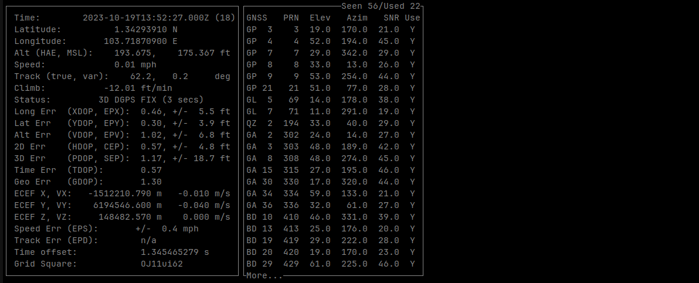

# GPSd Reference

gpsd is a service daemon that monitors GNSS receiver devices, inteprets the serial data and make the data available on TCP port 2947 for other programs to consume.

## Installation

You can install gpsd from apt-get on Ubuntu and Debian.

```bash
$ sudo apt-get install gpsd
```

After installation, there are two systemd services installed automatically. You can disable the two services or modify them according to your needs.

```bash
$ sudo systemctl stop gpsd.socket
$ sudo systemctl disable gpsd.socket
```

The "gpsd.socket" service monitors the 2947 port and triggers the gpsd.service to start if it detects any client applications trying to listen to the port. If you don't need this auto-triggering, you can disable this socket monitor.

## Typical Usage

### Monitor a GPS receiver

You can use gpsd to connect to a GPS receiver via serial/USB port:

```bash
$ sudo gpsd -D4 -N -n -s 115200 /dev/ttyUSB0
```

In the about example, the command has the following additional arguments:

* -D4: enable level 4 logging
* -N: to keep the program running at foreground
* -n: no need to wait for client application to connect
* -s: to set the baudrate to be 115200
* /dev/ttyUSB0: the port the GPS receiver is connected to

If the gpsd connects to the port successfully, you can use cgps to monitor the state of the GPS receiver:

```bash
$ cgps
```

### Feed RTCM data to a RTK receiver

If your GPS receiver supports differential or RTK mode, you can feed the correction data from a NTRIP server to the receiver:

```bash
$ sudo gpsd -G ntrip://<user-name>:<password>@<ntrip-server-address>:<ntrip-service-port>/<service-endpoint> -D4 -N -n -s 115200 /dev/ttyUSB0
```

With this command, you can feed the RTCM data to the receiver as well as receiving corrected positioning data from the receiver.

```bash
$ cgps -s
```

You should see something similar to this screenshot

