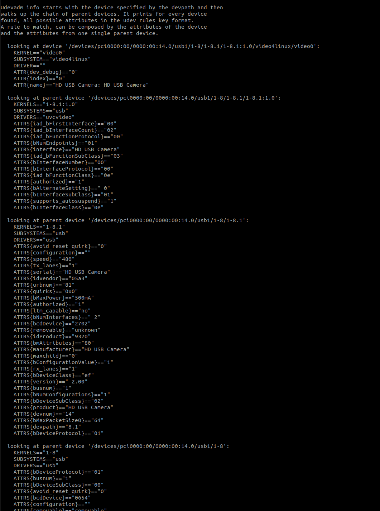

# Udev Reference

## Create a New udev Rule

All udev rules are placed at "/etc/udev/rules.d". The file follow the naming convension "[priority]-[name].rules", for example, "90-camera.rules". The lower the priority number, the higher the priority of the rule. When a device is added or removed from the system, rules with higher priority are processed first.

## Add New Rules for a Device

A typical rule may look like this:

```
SUBSYSTEMS=="usb", KERNEL=="ttyACM[0-9]*", ACTION=="add", ATTRS{idVendor}=="15d1", ATTRS{idProduct}=="0000", MODE="666", PROGRAM="/opt/ros/kinetic/lib/urg_node/getID /dev/%k q", SYMLINK+="sensors/hokuyo_%c", GROUP="dialout"
```

You can inteprate the rule as two parts:

```
[matching-conditions] [configurations]
```

The rule can be understood as: if "[matching-conditions]" are met, then apply "[configurations]".

For the matching part, you can use pattern matching. The following pattern matching rules and examples are taken from [1]:

```
* - match any character, zero or more times
? - match any character exactly once
[] - match any single character specified in the brackets, ranges are also permitted
```

For example: 

```
KERNEL=="fd[0-9]*", NAME="floppy/%n", SYMLINK+="%k"
KERNEL=="hiddev*", NAME="usb/%k"
```

Once a devide is matched, you can perform certain configurations, such as adding a symbolic link to the device node or name the device with a certain name. For example, you can create a symlink as "/dev/my-camera" to the device node matching the following "KERNEL" and "SUBSYSTEM" conditions:

```
KERNEL=="video[0-10]", SUBSYSTEM=="video4linux", ATTR{index}=="0", KERNELS=="1-8.1", ATTRS{idVendor}=="05a3", ATTRS{idProduct}=="9320", SYMLINK+="my-camera"
```

## Find Attribute Information of a Device Node

You can use the following command to find the attribute information of a device node:

```bash
$ udevadm info -a -p $(udevadm info -q path -n /dev/video0)
```

You can use the attributes of the device node or additional attributes from one of its parents to create a match condition. Note that you can not mix attributes from different parents.

The following screenshot shows what you may get by checking node "/dev/video0":



You can see how the sample rule shown in the previous section are created from the above information. Within the rule, the "KERNEL", "SUBSYSTEM", and "ATTR{inde}" are from the device node itself, while the "KERNELS" and "ATTRS{idVendor}" are from one of the parent nodes.

## Reload and Trigger New Rules

```bash
$ sudo udevadm control --reload-rules
$ sudo udevadm trigger --attr-match=subsystem=usb
```

## Reference

* [1] http://www.reactivated.net/writing_udev_rules.html
* [2] https://www.clearpathrobotics.com/assets/guides/kinetic/ros/Udev%20Rules.html