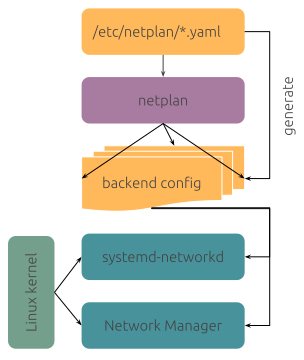

# Netplan Reference

## What is Netplan

Since Ubuntu 20.04, "netplan" is used to manage network interfaces. You can treat netplan as a frontend of network managers. The diagram from the official documentation illustrates this idea very clearly:



You configure the interfaces with the netplan config files and netplan will render the config files to the backend configs for the programs that actually manages the interface. Currently the two supported backend managers are **systemd-networkd** and **Network Manager**. 

**Note**: systemd-networkd and Network Manager are not the only two network managers in the Linux world. You may find other network managers such as Wicd, ConnMan in other Linux distributions. Raspberry Pi OS uses dhcpcd to manage the network interfaces by default.

## Netplan Configuration

Netplan configurations may exist in the following locations (ordered from higher priority to lower):

* /run/netplan/*.yaml
* /etc/netplan/*.yaml
* /lib/netplan/*.yaml

"Alphabetically later files, no matter what directory in, will amend keys if the key does not already exist and override previous keys if they do." [1]

### Apply Netplan configurations

After modifying the "*.yaml" file, you can use the following command to apply the changes:

```bash
$ sudo netplan apply
```

### Create a Loopback Interface

```yaml
network:
    version: 2
    renderer: networkd
    ethernets:
        lo:
            addresses: [ "127.0.0.1/8", "::1/128", "7.7.7.7/32" ]
```

### Connect to Network with DHCP

```yaml
network:
  version: 2
  ethernets:
    eth0:
      dhcp4: true
  wifis:
    wlan0:
      dhcp4: true
```

### Connect to Ethernet with Static IP

```yaml
network:
  version: 2
  renderer: networkd
  ethernets:
    eth0:
      dhcp4: no
      addresses:
        - 10.10.10.2/24
      nameservers:
        search: [mydomain, otherdomain]
        addresses: [10.10.10.1, 1.1.1.1]
      routes:
        - to: default
          via: 10.10.10.1
```

### Connect to Wireless Network with Static IP

```yaml
network:
  version: 2
  renderer: networkd
  wifis:
    wlan0:
      dhcp4: no
      dhcp6: no
      addresses: [192.168.0.21/24]
      nameservers:
        addresses: [192.168.0.1, 8.8.8.8]
      access-points:
        "network_ssid_name":
            password: "**********"
      routes:
        - to: default
          via: 192.168.0.1
```

### Configure a Network Bridge

```yaml
network:
  version: 2
  renderer: networkd
  ethernets:
      enp3s0:
          dhcp4: no
  bridges:
      br0:
          dhcp4: yes
          interfaces:
              - enp3s0
```

More references can be found at [3].

## Reference

* [1] https://netplan.io/faq
* [2] https://netplan.io/examples
* [3] https://netplan.readthedocs.io/en/latest/netplan-yaml/